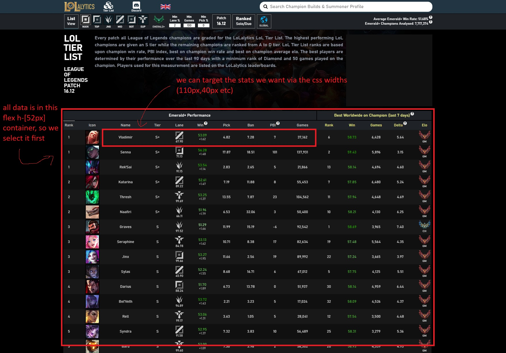
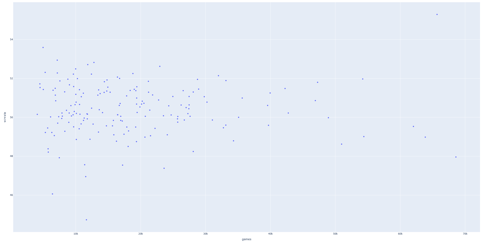

# simple scraper to extract league of legends champion data from lolalytics
this is a short project to scrape the data from https://lolalytics.com/lol/tierlist/ into a pandas dataframe and some short graphing analysis



## Running the project (run the line under each step in the terminal)
1. clone repository
```sh
git clone https://github.com/Kennyando/lolalytics_scraper.git
cd lolalytics_scraper.git
```
2. creating virtual env
```sh
python -m venv .venv
```
3. activating virtual env
```sh
.venv\Scripts\activate
```
4. installing library dependencies
```sh
pip install -r requirements.txt
```
5. running the program
```sh
python lolalytics_scraper.py
```

## background
The flow of what the file is doing is 
1. loading the website via selenium and making sure the whole page is loaded before we parse the data
2. parsing data with BeautifulSoup
3. targeting elements we want via css selector
4. append to dictionary and convert to pandas dataframe structure
5. clean data 
afterwards given the flexiblity of the dataframe you are free to manipulate it to whatever outcome you want, for this project my purpose was just to learn the webscraping part.Hence, I just exported it to an excel file and tried some visualizations using plotpy which has the interactive names on hover for the scatter plot.

## key learning points
### loading strategy
I would say these were my biggest takeaways, firstly it is essential that you know what state your webpage is being loaded before you scrape. Initially when I started, I was only able to scrape about 20/172 champions from the web because I was just using plain BS4. Then I found out you had to load the website which I tried doing via explicit wait times, which improved it to about 90/172. When selenium runs the window actually opens and shows which part is loaded, I moved my mouse accidentally and suddenly the whole page loaded. Then I got the idea to try to mimic human scrolling behavior by making the javascript scroll by only a few pixels but without stopping until it hit the bottom. That is essentially what the code below is doing.
```sh
driver.execute_script("window.scrollBy(0, 400);")
at_bottom = driver.execute_script("""
    return (window.innerHeight + window.scrollY) >= document.body.scrollHeight
""")
if at_bottom:
    break
```
## targetting desired elements
I kind of just poked around on the inspect element on the website until I found something to try to target. At first I found out that the champion divs had a special key for the corresponding data so I implemented that but for reason, lolayltics only did that for about 50 champions, interesting... Then I tried to target the css pixel lengths since I thought that there weren't many repeating widths and thankfully that worked. I would say just poking around on the inspect element will provide invaluable insights for your scraping purposes. Just mess around and try and find out how the website works.

## analysis (I guess bro)

if you run the program this scatter plot will open and at the time which i ran it (14/6/26), it seems that Senna is completely broken sitting at the highest WR and most games played(56.3% 130k games), mel is just bad (46.9% 22.5k games) and ADC players still cannot play ezreal (48.8% 128k games).It is quite cool to see the scatter because the outliers are very obvious and as a former (thank goodness) league player you know exactly why they are at the data point.
Go try comparing the other data points pick,ban,games whatever.

Cheers,
Kennan